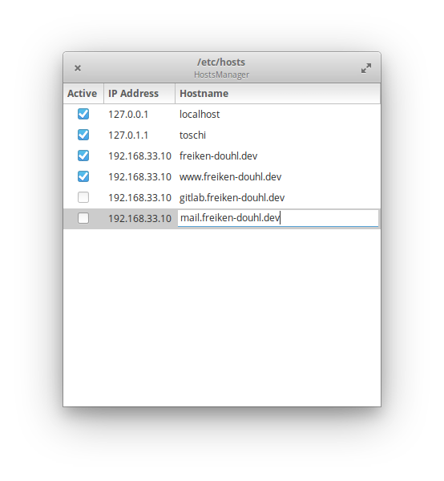

# HostsManager App

Managing your `/etc/hosts` file.

<p align="right">
  <a href="https://appcenter.elementary.io/com.github.bbuhler.hostsmanager" style="float:right">
    
  </a>
</p>

<p align="center">
  
</p>

### Compile & install
```sh
meson build --prefix=/usr
cd build
ninja
sudo ninja install
```